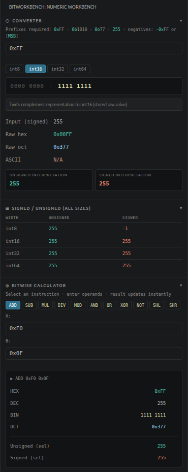

<div align="center">
    <h1>BitWorkbench</h1>
</div>

> **A numeric systems workbench for low-level developers.**

BitWorkbench is a Visual Studio Code extension that provides an integrated numeric conversion and bitwise calculation panel directly inside your editor.

Stop switching between your IDE and external hex calculators. BitWorkbench brings numeric conversion, binary visualization, signed/unsigned interpretation, fixed-width integer analysis, and bitwise operations into a single developer-focused sidebar.

Designed for:
- systems programming
- C/C++
- Assembly
- embedded development
- reverse engineering
- kernel development
- low-level debugging

---

# Screenshot

<div align="center">
    </img>
</div>

---

# Features

## ✦ Numeric Converter

- Live conversion between:
  - binary
  - decimal
  - hexadecimal
  - octal

- Strict prefix enforcement eliminates ambiguity:
  - `0xFF` → hexadecimal
  - `0b1010` → binary
  - `0o77` → octal
  - `255` → decimal

- Hexadecimal, binary, and octal values require explicit prefixes
- Decimal values use plain digits

No silent guessing. No ambiguous parsing.

---

## ✦ Signed / Unsigned Visualization

BitWorkbench displays:
- unsigned values
- signed values
- raw fixed-width representations

Supported integer widths:
- int8
- int16
- int32
- int64

Example:

```text
Input: 0xFF

int8
Unsigned: 255
Signed:   -1

int16
Unsigned: 255
Signed:   255
```

All integer widths are displayed simultaneously for quick comparison.

---

## ✦ Fixed-Width Integer Semantics

BitWorkbench behaves like a real fixed-width integer environment.

Negative numbers automatically use two's complement representation according to the selected width.

Example:

```text
Input: -1
Width: int8

Raw hex:   0xFF
Unsigned:  255
Signed:    -1
```

### Signed Interpretation vs Truncation

BitWorkbench explicitly distinguishes between:
- signed reinterpretation
- real truncation/wrapping

Example — reinterpretation only:

```text
Input: 0x80
Width: int8

Raw value remains: 0x80
Unsigned: 128
Signed: -128
```

No bits were lost.

Example — real truncation:

```text
Input: 0x1FF
Width: int8

Stored raw value: 0xFF
```

Higher bits are discarded because the value exceeds the selected storage width.

When truncation occurs, BitWorkbench displays explicit warnings.

---

## ✦ Binary Visualization

Binary values are grouped for readability.

Examples:

```text
11111111
→
1111 1111
```

```text
0000000011111111
→
0000 0000 1111 1111
```

Features:
- nibble grouping
- byte separation
- highlighted set bits
- dimmed cleared bits

Optimized for:
- bitwise operations
- register visualization
- debugging
- memory analysis

---

## ✦ ASCII Integration

ASCII values are automatically resolved.

Examples:

```text
0x41 → 'A'
0x0A → <LF>
0x1B → <ESC>
0x01 → <SOH>
```

Non-printable characters use descriptive labels.

Out-of-range values return:

```text
N/A
```

---

## ✦ Bitwise Calculator

BitWorkbench includes an assembly-inspired integer calculator.

Supported arithmetic operations:
- ADD
- SUB
- MUL
- DIV
- MOD

Supported bitwise operations:
- AND
- OR
- XOR
- NOT

Supported shift operations:
- SHL
- SHR

Results update instantly in:
- hexadecimal
- decimal
- binary
- octal
- signed
- unsigned

---

## ✦ Editor Integration

Select any numeric literal in your editor:
- `0xFF`
- `0b1010`
- `0o77`
- `255`

BitWorkbench automatically updates.

Commands:
- `BitWorkbench: Open Panel`
- `BitWorkbench: Analyze Selected Value`

Supports:
- command palette
- context menu
- keyboard shortcuts

---

## From Source

```bash
git clone https://github.com/your-username/bitworkbench.git
cd bitworkbench

npm install
npm run compile
```

Press `F5` to launch the Extension Development Host.

---

## Building a VSIX Package

```bash
npm install -g @vscode/vsce

vsce package

code --install-extension bitworkbench-1.0.9.vsix
```

---

# Usage

## Converter

Enter values using the required format:

| Input | Meaning |
|---|---|
| `0xFF` | Hexadecimal |
| `0b11110000` | Binary |
| `0o377` | Octal |
| `255` | Decimal |
| `-1` | Signed decimal |

Select:
- int8
- int16
- int32
- int64

All outputs update instantly.

---

## Bitwise Calculator

Examples:

```text
AND 0xF0 0x0F
→ 0x00
```

```text
OR 0xF0 0x0F
→ 0xFF
```

```text
XOR 0xFF 0x0F
→ 0xF0
```

```text
SHL 0x01 4
→ 0x10
```

```text
NOT 0x00
→ depends on selected width
```

---

## Overflow and Width Behavior

Example:

```text
Input: 0x80
Width: int8
```

Result:

```text
Unsigned: 128
Signed:   -128
```

This is a signed reinterpretation, not truncation.

Example:

```text
Input: 0x1FF
Width: int8
```

Result:

```text
Stored value: 0xFF
```

Higher bits are truncated.

BitWorkbench warns when:
- values exceed signed ranges
- values exceed storage width
- truncation occurs

---

# Supported Formats

| Format | Example | Prefix |
|---|---|---|
| Hexadecimal | `0xFF` | `0x` |
| Binary | `0b1010` | `0b` |
| Octal | `0o77` | `0o` |
| Decimal | `255` | none |

---

# Calculator Examples

```text
ADD 0xFF 1
→ 0x100
```

```text
SUB 0x100 0x01
→ 0xFF
```

```text
MUL 0x10 0x10
→ 0x100
```

```text
DIV 0xFF 0x10
→ 0x0F
```

```text
MOD 0xFF 0x10
→ 0x0F
```

```text
AND 0b11110000 0b00001111
→ 0b00000000
```

```text
OR 0b11110000 0b00001111
→ 0b11111111
```

```text
XOR 0b11111111 0b00001111
→ 0b11110000
```

```text
NOT 0x00
→ width dependent
```

```text
SHL 0x01 4
→ 0x10
```

```text
SHR 0x80 3
→ 0x10
```

---

# Roadmap

- [ ] Endianness visualization
- [ ] IEEE754 float32 / float64 visualization
- [ ] Bit-field editor
- [ ] Expression history
- [ ] Keyboard-driven calculator mode
- [x] Copy buttons
- [ ] Status bar integration
- [ ] Colorized bit visualization
- [ ] Export/share conversion results

---

# Contributing

Contributions, issues, and feature requests are welcome.

```bash
git checkout -b feature/my-feature
```

```bash
git commit -m "Add my feature"
```

```bash
git push origin feature/my-feature
```

Then open a Pull Request.

Please ensure:
- TypeScript compiles successfully
- code follows project structure
- new features are documented

---

# Project Structure

```text
bitworkbench/
├── src/
│   ├── extension.ts
│   ├── providers/
│   │   ├── BitWorkbenchViewProvider.ts
│   │   └── webviewContent.ts
│   └── utils/
│       ├── numeric.ts
│       └── selectionDetector.ts
├── resources/
│   ├── icon.svg
│   ├── icon.png
│   └── workbench.png
├── .vscode/
│   ├── launch.json
│   └── tasks.json
├── package.json
├── tsconfig.json
└── README.md
```

---

# License

MIT License — see `LICENSE` for details.

---

*Built for systems programmers, reverse engineers, embedded developers, and anyone who thinks in bits.*
