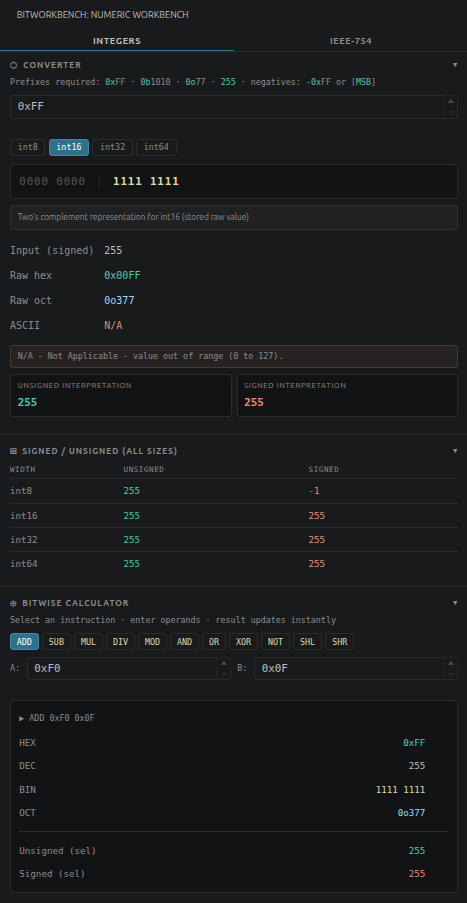
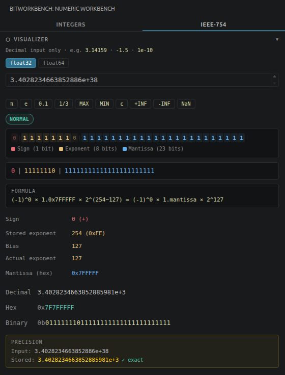

<div align="center">
    <h1>BitWorkbench</h1>
    <p><em>A numeric systems workbench for low-level developers.</em></p>
</div>

<div align="center" style="display: flex; gap: 20px;">
    </img>
    </img>
</div>

---

BitWorkbench is a VS Code extension that brings numeric conversion, binary visualization, IEEE-754 float analysis, and bitwise calculations into a single developer-focused sidebar. No more switching between your IDE and external calculators.

Built for systems programming, embedded development, reverse engineering, and anyone who thinks in bits.

---

# Features

## ✦ Numeric Converter

Live conversion between hex, decimal, binary, and octal with strict prefix enforcement — no silent guessing.

| Input | Format |
|---|---|
| `0xFF` | Hexadecimal |
| `0b1010` | Binary |
| `0o77` | Octal |
| `255` | Decimal |
| `-1` | Signed decimal |

## ✦ Signed / Unsigned & Fixed-Width Integers

Displays unsigned, signed, and raw representations simultaneously across int8, int16, int32, and int64. Behaves like a real fixed-width environment — negative numbers use two's complement, and BitWorkbench explicitly distinguishes between signed reinterpretation (no bits lost) and real truncation (higher bits discarded). Overflow warnings fire when values exceed the selected width.

## ✦ IEEE-754 Visualizer

Breaks down any float into its sign, exponent, and mantissa fields for both float32 and float64. Shows the hex and binary representations, and a precision box comparing your input value against what the format actually stores.

```text
Input: 3.14159

Decimal  3.14159274101257324
Hex      0x40490FDB
Binary   0b01000000010010010000111111011011

Sign      0 (+)
Exponent  10000000  (stored 128, actual 1)
Mantissa  10010010000111111011011

Precision
  Input:  3.14159265358979  (your value)
  Stored: 3.14159274101257  (what float32 actually holds)
```

Supports special values: `+INF`, `-INF`, `NaN`, `MAX`, `MIN`, `ε`, `π`, `e`.

## ✦ Binary Visualization

Bits grouped into nibbles and bytes, with set bits highlighted and cleared bits dimmed.

## ✦ ASCII Integration

Automatically resolves byte values to ASCII. Printable characters shown directly, non-printable ones labeled (`<LF>`, `<ESC>`, `<SOH>`, etc.). Out-of-range values return `N/A`.

## ✦ Bitwise Calculator

Assembly-inspired calculator with instant results in hex, decimal, binary, octal, signed, and unsigned.

| Category | Operations |
|---|---|
| Arithmetic | `ADD` `SUB` `MUL` `DIV` `MOD` |
| Bitwise | `AND` `OR` `XOR` `NOT` |
| Shift | `SHL` `SHR` |

```text
AND 0xF0 0x0F  →  0x00
XOR 0xFF 0x0F  →  0xF0
SHL 0x01 4     →  0x10
NOT 0x00       →  width dependent
```

## ✦ Editor Integration

Select any numeric literal in your editor and BitWorkbench updates automatically.

Commands: `BitWorkbench: Open Panel` · `BitWorkbench: Analyze Selected Value`

Available via command palette, context menu, and keyboard shortcuts.

---

# Installation

## From Source

```bash
git clone https://github.com/your-username/bitworkbench.git
cd bitworkbench
npm install
npm run compile
```

Press `F5` to launch the Extension Development Host.

## As a VSIX Package

```bash
npm install -g @vscode/vsce
vsce package
code --install-extension bitworkbench-1.0.9.vsix
```

---

# Roadmap

- [x] IEEE-754 float32 / float64 visualizer
- [x] Expression history
- [x] Copy buttons
- [ ] Endianness visualization
- [ ] Bit-field editor
- [ ] Keyboard-driven calculator mode
- [ ] Status bar integration
- [ ] Colorized bit visualization
- [ ] Export/share conversion results

---

# Contributing

Contributions, issues, and feature requests are welcome. Please ensure TypeScript compiles successfully and new features are documented.

```bash
git checkout -b feature/my-feature
git commit -m "Add my feature"
git push origin feature/my-feature
```

Then open a Pull Request.

---

# License

MIT License — see `LICENSE` for details.

*Built for systems programmers, reverse engineers, embedded developers, and anyone who thinks in bits.*